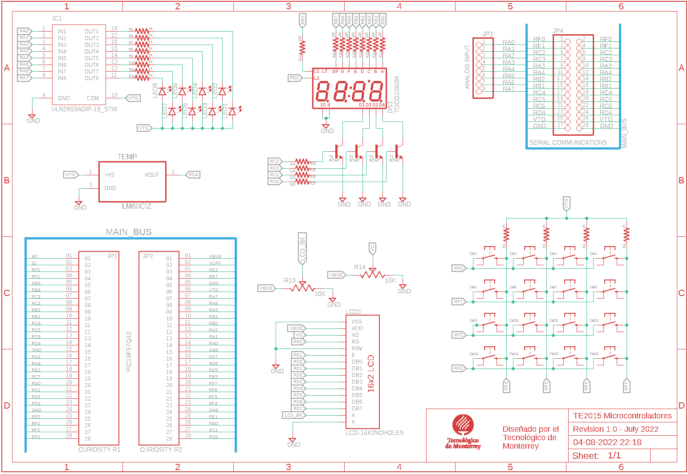

  

# LB1. Expansion Board: schematic capture

## Description
In this project you will design an expansion board with different peripherals to interface with the Curiosity Nano PIC18F57Q43 Evaluation board. Additionally, you can interface your expansion board with other microcontrollers such as Arduino, ESP8266, Raspberry Pi or any other microcontroller or FPGA evaluation board with the proper wiring. This project was designed for educational purposes, thus it only serves as an interface between the peripherals (e.g. LCD display, 7-segment displays, matrix keypad, and others), and an the microcontroller. No programming/debugging nor voltage regulation circuitry are considered. Moreover, no hardware drivers are included since these are meant to be softcoded by you and programmed on the microcontroller. 

This project is split in two parts: 1) Schematic capture and 2) Physical layout. For part 1 we will capture the board schematic with all devices and their values and peripheral units. In part 2 we layout all of the components and connect them using virtual traces, such a way as the final product will look once manufactured. 

Once this project is fully captured, you will end up with a set of files called __GERBER__ files, which are sent out to a manufacturer to get your board fabricated. There are several PCB manufacturers around the country and even abroad (delivery might take a couple of weeks, depending on the shipment service you choose). Good quality and fast turnaround manufacturers include OSH Park, JLCPCB and PCBWay. Once you have your Gerber files ready, you can quote the manufacturing of your designs following the links below. 

You can also manufacture your board in-campus using our laser prototyping service with a turn-around time of just a few days; however, two-layer boards are not guaranteed, thus this service it is not recommended. ___Notice that since you are enrolled in course TE2015, board manufacturing is required as you will use your board throughout our laboratory.___

After you receive your manufactured board, it is your job to assemble all the components to obtain the final product. This includes setting up your work bench with a soldering station, soldering material, and board components. It is advised to manufacture more than one board since strong soldering skills are required and this is only achieved by practice (3 boards is a good choice).

This brings one more important topic to consider for your design. You also need to buy all electronic components for your board. These components include resistors, transistors, push-buttons, LEDs, LCD and 7-segment displays, temperature sensor and headers. The latest version of the components list can be downloaded from the link below:

## Software 
### __AUTODESK EAGLE__

We will use Eagle to capture the schematic and layout views of our design. For this course the Educational license will be used; however, the working principle is similar for other tools, including professional software. Most PCB tools work very similar, thus you can expect that once you learn to use Eagle, you can rapidly learn similar tools, including licensed software, such as Altium Designer and Proteus. You can download the installed from the link below:

Before our first lab session, you will receive an e-mail from your professor with an invitation to join your group at Autodesk website, where you should create an account using your **student e-mail address**. Once you sign up, you will be able to download the software. 

### __GIT KRAKEN__

Git Kraken client will be used to keep up to date our GitHub repository in your computer. Moreover, some laboratories will require to push your deliverable to an own repository so the professor can easily access your reports from there. You can also use this client to push your files to your own repository. Most of the times, you will push your deliverables to your repository and only turn in the corresponding link on Canvas. Download the GitKraken client from the link below:

Install the client in your computer and log in using your own GitHub credentials. It is recommended that if you do not have a Github account, you sign up using your student email address.

## Lab Procedure
### __STEP 1. ADD THE TE2015 LIBRARY TO EAGLE__

First thing to do once you have installed EAGLE on your computer is to get a copy of the class library, which includes schematic symbols, footprints and 3D views of all the components of the expansion board. We have created an Eagle library which includes all the components for your design. This library is freely available and will be available for you once you accept the invitation to join our course group at Autodesk website. You can see the library at Library.io website:

Verify that library __TE2015_Microcontroladores.lbr__ is added to your _Libraries_ folder on EAGLE. If you can't find the library, tell the professor to get access granted to this library. __You must make sure that you have access to the TE2015 before continuing with the lab procedure__

### __STEP 2. CREATE AN EAGLE PROJECT__
1. Once Eagle has loaded on your computer, create your board project by going to _File → New → Project_. Give your project the name __TE2015 Expansion Board__. This will add a new folder under your _Projects_ folder with the name you just typed in. Two important files will be stored under this folder: an `.sch` file containing your schematic diagram, and a `.brd` file with the physical layout of your board. Both files are linked to each other, thus you should keep them both open regardless if you are working with the schematic or layout views in order to ensure them synchronized.

2. Now, go to _File → New → Schematic_ to create the schematic view of your design (alternatively, you can right-click on your project name and select _New → Schematic_ to do so). With this, an empty _Schematic_ window pops up, where you can start capturing your diagram. 

### __STEP 3. ADD THE BOARD COMPONENTS TO THE SCHEMATIC VIEW__
The schematic diagram you aim to capture is shown below. It is integrated by 5 different circuits, which are 1) LED driver, 2) Analog temperature sensor, 3) 4-digit 7-segment display, 4) 16x2 LCD display, and 5) 4x4 matrix keypad. Moreover, 4 headers are used for external connections: two 28-pin headers to insert the Curiosity Nano board, one 8-pin header for analog inputs and one 2-row 28-pin header for serial communications. 

Library __TE2015_Microcontroladores.lbr__ holds all the necessary components for the 5 five circuits, as well as the headers for external connections. However, some components such as Ground and Power symbols belong to other Eagle libraries. Place your components to look similar to the diagram above for an easier wiring. The full list of components arranged by each circuit is shown below:

| Circuit | Quantity | Component | Description | Library |
|---|---|---|---|---|
| LED driver | 8 | LED3MM | LED, 3mm diameter | TE2015_Microcontroladores.lbr | 
| LED driver | 8 | R_US | Resistor | TE2015_Microcontroladores.lbr |
| LED driver | 2 |  MPQ2222 | QUAD NPN Transistor | TE2015_Microcontroladores.lbr |
|
| Analog temperature sensor | 1 | LM60CIZ | Analog temperature sensor | TE2015_Microcontroladores.lbr |
|
| 4-digit 7-segment display | 1 | TDCG1060M | 4-digit 7-segment display, Common Cathode | TE2015_Microcontroladores.lbr |
| 4-digit 7-segment display | 9 | R_US | 130 OHM Resistor | TE2015_Microcontroladores.lbr |
| 4-digit 7-segment display | 4 | R_US | 52 KOHM Resistor | TE2015_Microcontroladores.lbr |
| 4-digit 7-segment display | 4 | BC547 | NPN transistor | TE2015_Microcontroladores.lbr |
|
| 16x2 LCD display | 2 | LCD_16X2NOHOLES | 16x2 LCD display | TE2015_Microcontroladores.lbr |
| 16x2 LCD display | 2 | 3362P-1-103LF | 10KOHM Trimmer | TE2015_Microcontroladores.lbr |
|
| 4x4 matrix keypad | 16 | 1825910-2 | SPST push button | TE2015_Microcontroladores.lbr |
| 4x4 matrix keypad | 4 | R_US | 1KOHM Resistor | TE2015_Microcontroladores.lbr |
|
| All of above | as required | GND | Ground connection | supply2 |
|
| Headers | 2 |  SS-128-T-2 | 1-row, 28-pin female header |TE2015_Microcontroladores.lbr |
| Headers | 1 | PINHD-1X8BIG | 1-row, 8-pin female header |TE2015_Microcontroladores.lbr |
| Headers | 1 | PINHD-2X14-CB | 2-row, 28-pin female header |TE2015_Microcontroladores.lbr |

### __STEP 4. WIRE YOUR SCHEMATIC DIAGRAM__
Once you have added your components, you can wiring them using nets or buses. Buses are great when working with many connections as in this case, where we need to connect ~56 pins from the Curiosity board to the different peripherals. Make sure to wire accordingly since all of our programming laboratories assume these connections are hardwired between both boards and it is not possible to re-wire. The table below shows the connections between the Curiosity board and the different peripherals on our expansion board. An __*__ preceding a peripheral pin indicates either a passive (resistor), active (transistor), or both, are located between those two nodes. See the schematic diagram for the corresponding circuit to check the actual paths.

| PIC18 PORT | PERIPHERAL PIN | PIC18 PORT | PERIPHERAL PIN | PIC18 PORT | PERIPHERAL PIN | 
| --- | --- | --- | --- | --- | --- | 
| RA0 | *LED1   | RC0 | *SSEG_4    | RE1  | LCD_RS
| RA1 | *LED2   | RC1 | *SSEG_3    | RE0  | LCD_EN
| RA2 | *LED3   | RC2 | *SSEG_2    | RE2  | SSEG_L1L2
| RA3 | *LED4   | RC3 | *SSEG_1    | RE3  | SSEG_L3
| RA4 | *LED5   | RC4 | LM60_VOUT  | RE4  | 
| RA5 | *LED6   | RC5 |            | RE5  | 
| RA6 | *LED7   | RC6 |            | RE6  | 
| RA7 | *LED8   | RC7 |            | RE7  | 
| RB0 | *SSEG_A | RD0 | LCD_0RE0   | RF0  | KEYP_1
| RB1 | *SSEG_B | RD1 | LCD_1RE1   | RF1  | KEYP_2
| RB2 | *SSEG_C | RD2 | LCD_2RE2   | RF2  | KEYP_3
| RB3 | *SSEG_D | RD3 | LCD_3RE3   | RF3  | KEYP_4
| RB4 | *SSEG_E | RD4 | LCD_4RE4   | RF4  | *KEYP_5
| RB5 | *SSEG_F | RD5 | LCD_5RE5   | RF5  | *KEYP_6
| RB6 | *SSEG_G | RD6 | LCD_6RE6   | RF6  | *KEYP_7
| RB7 | *SSEG_P | RD7 | LCD_7RE7   | RF7  | *KEYP_8
 
Once you have wired all the peripheral circuits, wire the headers that you will use to mount your Curiosity Nano board, and for external connections. 

Finally, wire the trimmers that will serve as contrast control for the LCD display, as well as the power and ground connections required for all the circuits. Your circuit must look similar to the schematic shown above. 

### __STEP 5. PERFORM A ELECTRIC RULE CHECK (ERC)__
Under menu Tools, select ERC. This will perform an Electric Rule Check on your schematic. This helps to find possible errors on your capture, such as short circuits, unconnected nodes and wires, unpowered devices, and much more. When the test is done, a window pops-up showing the results, including Errors and Warnings. Errors are issues that MUST be corrected in order to avoid potential failures of your circuit. Warning are issues that might be signaling possible malfuctionings, but do not represent electrical failures.

Carry out an ERC test on your schematic diagram and check Erros and Warnings in a case to case basis. Make sure no errors are found and decide either if warnings must be corrected or can be ignored. Do not proceed to the PCB layout if you still find errors on your schematic. 

### __DELIVERABLES__
Deliverables for LB1 are:
1. EAGLE project 
   * Include the schematic diagram without ERC errors.
   * Push your project files into your GitHub repository
2. Demostrative video 
   * Make a 3-minutes video explaining showing each of the different circuits on your schematic. 
   * Start explaining the values of power signals `VTG` and `VBUS`.
   * For the analog temperature sensor, according to its datasheet, explain what are the minimum and maximum values `VOUT` can output, as well as the corresponding temperature values.
   * The LED driver circuit uses the common-anode configuration and makes use of Darlington transistors to control the current across the LEDs. Explain how to determine the current across those LEDs. 
   * The 7-segment display circuit controls 4 digits that cannot be turned on at the same time due to limitation on the current the PIC18 can deliver. How do you propose to address this issue if we want to see the four digits on for our applications.
   * Explain how the pull-up resistors of the 4x4 keypad work. Why it is benefical to use pull-ups for push-buttons and other devices? 