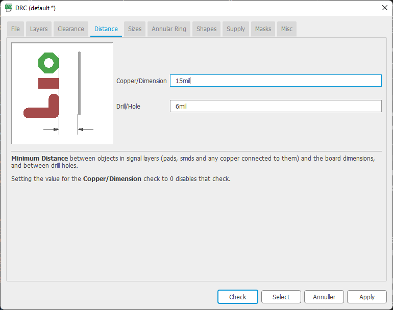
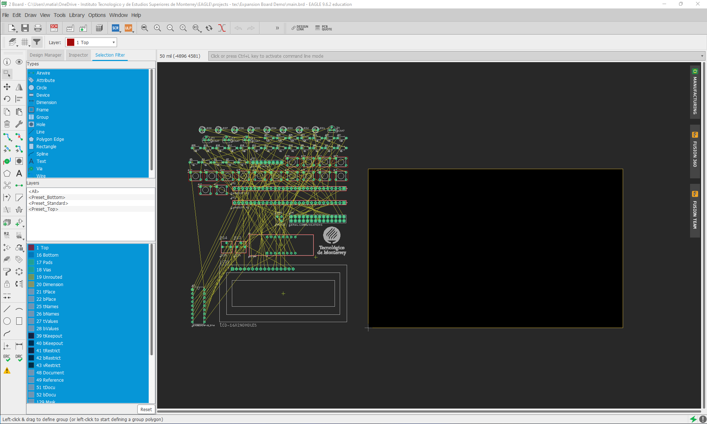

  

# LB2. Expansion Board: Physical Layout

## Description
This is the second part of the Expansion Board design. In this part you will finish designing your board by putting all the components' footprints in place inside the board and routing all of the electrical connections along the two sides of the board: top and bottom. Once you are done routing your board, it is important to carry out a test that will let you know if the component placemente and the copper tracks can be fabricated by the manufacturer, which is called the Design Rule Check (DRC). For this, we need to set the manufacturer's design rules first and then perform the test considering such rules you previously established. Once the test is passed, you can be sure the manufacturer is able to fabricate your board without setback. For a better undestanding of the PCB fabrication process, watch the video <a href="https://www.youtube.com/watch?v=YJr-kHy6STg">What is a PCB?</a>.

## Lab Procedure
### __STEP 1. SET THE DESIGN RULES__
After finishing your schematic diagram, the layout view of your board can be created. For this, go to _File_ menu and select _Switch to board_.

Once the board view is open, select _DRC_ under _Tools_ menu to open the design rule window. Across the different tabs of this windows you define the design rules of your design, according to the manufacturer fabrication capabilities. Go through tabs _Clearance_, _Distance_, _Sizes_ and _Annular Ring_ and set the parameters as shown in the figures below. Note that all distances are expressed in __mil__ units, which represents the thousandth of an inch. 

### __STEP 2. PLACE THE COMPONENTS INSIDE THE BOARD BOUNDERIES__
The figure below shows the layout view of your board including all the components and a predefined board with and area of 160 mm x 100 mm. This predifined board is enough to place and route all your components, thus you can start placing the components inside. 

Once you are done placing the components, the board should like as the one shown below. You can readjust the board dimensions if you consider more or less space is suitable for your component arrangement. 

### __STEP 3. ROUTE ALL THE CONNECTIONS__
Route your components by using the Autoroute tool. This way, the tool will make sure that design rules are fulfilled as routing takes place. The routing process will take some time, depending on your computer. To use the Autorouter tool, select _Autorouter_ under _Tools_ menu. 

You can use the predefined settings as shown below and click _Continue_. The following window shows the percentage of tracks that have been routed by the Autorouter. After clicking _Start_, the tool starts the routing process and you can monitor the progress on the same window.

Once the Autorouter has router 100% of the tracks, you can stop the process by clicking _End Job_. If you leave the process longer, it will try to optimize the tracks by reducing the track length the amount of vias that are placed. It is recommended to allow the Autorouter to optimize the design so it is less prone to fabrication errors. The figure below shows when 100% of the tracks have been routed and you can end the process.

The resulting board will show now all the tracks that interconnect the components in your board. Red tracks correspond to tracks on the top copper layer, and blue tracks show those on the bottom copper layer. 

### __STEP 4. CARRY OUT A DESIGN RULE CHECK__
Open the DRC window and click _Check_ to run the test. In case design errors are found, an error window will pop-up describing the errors found. If no errors are detected, anything will pop up and the test is passed.

### __STEP 5. GENERATE THE GERBER FILES__
Under _File_ select _CAM Processor_. On the CAM Processor window, select _Gerber_ on _Output Files_ to see the Gerber file options. The image below shows the settings for the Gerber files. Make sure `Export as ZIP` and `Gerber RS-274X` are selected.

Under the _Gerber_ tab you can see all the different layers on you design, such as top and bottom copper, soldermasks, silkscreens, etc. Clicking on any of the layers will shown a preview of such layer. 

To generate your files click _Process Job_, find a location for your ZIP file and click _Save_.

The files will be then generated and located in the folder of your choice. 

### __STEP 6. SEND OUT YOUR FILES FOR BOARD MANUFACTURE__
Some manufacturers have a quotation system that allow you to upload your GERBER files to then generate an estimated price for your design. Select the minimum quantity of boards that the manufacturer can fabricate and get an approximate cost for your design. See below three reliable manufacturers with an self quotation system that you can use for your  board:

### __STEP 7. GET THE ELECTRONIC COMPONENTS__
The final step is to get the electronic components for your board. In this sense, there is a pre-made Bill of Materials (BOM) that keeps an updated list of components required for the assembly. It is kept on Digikey and you can access it following the link below:

The BOM keeps the minimum amount of each component required to assembly one board. Feel free to modify the component quantity in case you want to assemble more than one board or get spares in case you loose or damage any component during assembly and soldering.

If you would like to receive your components at campus instead of a personal address, ask your professor for address details. 

### __DELIVERABLES__
Deliverables for LB2 are:
1. EAGLE project 
   * Include the schematic diagram without ERC errors.
   * PCB layout without DRC errors  
   * Push your project files into your GitHub repository.
2. Demostrative video 
   * Make a 2-minutes video showing the finished board to complement your last video presentation. In this case, perform a DRC test to demonstrate that your design is ready for fabrication.
   * Also, explain the process to generate the Gerber files and show the quotation you get from the manufacturer of your choice.
      
      _Note that a similar DRC will be carried out by the manufacturer to make sure your board can be manufactured. You will get a confirmation if your design is ready for fabrication_. 
   * _Optional:_ Show the 3D view of your video on Fusion 360. 