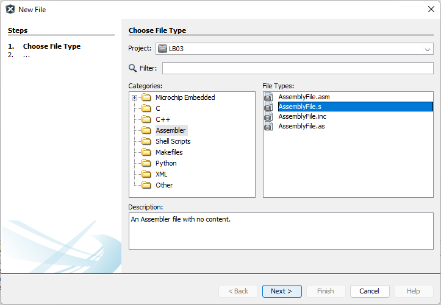

<p align="left">
  
</p>

# **Laboratory 2. PIC18 and MPLAB basics**

## **OBJECTIVES**
* Create projects on MPLAB X
* Set configuration bits using MPLAB Code Configurator
* Define program sections
* Drive LED strings using a port of the microcontroller

## **PRE-LAB WORK**
Before our lab session it is required that you install the development tools we will use; this include _MPLAB X_, which is Microchip's integrated development environment (IDE). As we will write C code for an 8-bit microcontroller (&mu;C) architecture, we also require to install the corresponding Microchip's C compiler, so called _XC8_. We will also make use of a plugin that will help us generate configuration code in a straightfoward way, which is called MPLAB Code Configurator (MCC). Finally, we will use GitHub for version control of our PIC18 coding projects. 

The following three sections will guide you with the installation and setup of all the required tools for our lab; so make sure you properly install everything before our lab session. 

### 1. MPLAB X IDE
1. Go to https://www.microchip.com/mplab/mplab-x-ide, scroll down to Downloads section and download the latest version of MPLAB X IDE
2. Install it in your computer.

### 2. XC8 COMPILER
Download it and install it from the official [Microchip Compilers website](https://www.microchip.com/en-us/development-tools-tools-and-software/mplab-xc-compilers).

## __LABORATORY DESCRIPTION__
In this labnoratory we aim to develop code to blink the on-board LED at `RF3`, each 1 second, with 50% duty cycle. For this, we will code a delay generator that sets the time the LED is either in on or off states. 

The oscillator to use in this lab is the High-Frequency Internal Oscillator, HFINTOSC, running at 1 MHz. To configure HFINTOSC to run at 1 MHz, the corresponding values for configuration bits `RSTOSC` and `FEXTOSC` of `CONFIG1` configuration register must be assigned. In this case, we will choose `RSTOSC = 110`, which assigns the oscillator frequency `HFFREQ = 4 MHz` and clock division `CDIV = 4:1`. As we are not using an external oscillator, `FEXTOSC = OFF`. The oscillator will then run at f = 1 MHz, corresponding to TCY = 4 µs considering 4 oscillator periods make 1 TCY. 

__Note that this configuration ONLY applies to the actual device; for simulation, we MUST configure the oscillator frequency in the project properties. The default instruction frequency for simulation is 1 MHz, or TCY = 1 µs.__

The following PIC-AS code generates a delay that is determined by the number of cycles `DELAY_COUNT` loop is executed inside the `DELAY` routine. The number of repetitions is assigned to the `COUNT` register, which in this is `0x05`. 
```
LOOP:
    BSF     LATF,3,0
    CALL    DELAY; 2                ; 2xTCY
    BCF     LATF,3,0
    CALL    DELAY
    GOTO    LOOP

DELAY:
    MOVLW   0x05                    ; 1xTCY
    MOVWF   BANKMASK(COUNT),0       ; 1xTCY
DELAY_COUNT:
    DECFSZ  BANKMASK(COUNT),1,0     ; (K-1)*1 + 3) TCY
    GOTO    DELAY_COUNT             ; (K-1)*2 TCY	
    RETURN                          ; 2xTCY	
```
The cycle time for each instruction is commented for each instruction inside the `DELAY` loop (obtained from the PIC18F57Q43 datasheet, Table 44.2, column Cycles). Here, `K` is the value loaded to `COUNT` and represents the number of times the routine will be repeated; in this case, `COUNT = 0x05`. The total TCY for the `DELAY` loop is then the addition of the TCYs for each instruction:

`TCY_DELAY = 2 + 1 + 1 + (K-1)·1 + 3 + (K-1)·2 + 2`

Simplifying, TCY_DELAY = 6 + 3K. Since the value loaded to COUNT is `0x05`, `K = 5`, and __TCY_DELAY = 6 + 3(5) = 21 TCY__. 

We can easily verify the TCY count using the Stopwatch in MPLAB X simulator. For this, we add a breakpoint at the line where we want to start counting, and one more breakpoint at the line where we want to stop the count. To know the instruction cycles for the `DELAY` routine, we add the first breakpoint at the `CALL DELAY` instruction. The second breakpoint should be after the `RETURN` instruction, that is, at the `BCF LATF, 3, 0` instruction. This is shown below:

<div align="center">
   
</div>

The stopwatch output then shows the cycle count between the two breakpoints:

<div align="center">
   
</div>

As this is a simulation, the total delay is 21 µs if we use the default settings, as in this example. However, the actual microcontroller will generate an oscillator frequency of 1 MHz, or 4 µs per TCY. In this case, the generated delay is __21 TCY * 4 µs/TCY = 84 µs__.

<!--
This delay must account for the 50% of 1 second and will be used to keep the LED on and off during that time. If the duty cycle is then 500 ms, we will need a TCY counter in data memory capable of holding values up to 0.5/0.000,004 = 125,000. To store this data, 17 bits in total are required. Since memory assignments are byte-wise, we then need 3 bytes of data memory for 24 bits, and will only use 17 of those 24, `COUNT[16:0]`. 

| BYTE | NAME | LENGTH | COUNT | POSITION |
|:---:|:---:|:---:|:---:|:---:|
Byte 1 | `COUNT1` | `[7:0]` | 0 - 255 | LSB |  
Byte 2 | `COUNT2` | `[7:0]` | 0 - 255 |  |
Byte 3 | `COUNT3` | `[0]` | 0 - 1 | MSB |

With these settings, we are able to count up to 2<sup>17</sup> = 131,072, which equals 524.3 ms. This means that the clock signal will have an error of ~4.86%.
-->

## __EXERCISE 1: SIMULATE AN OSCILLATOR FREQUENCY OF 1 MHz__
1. Start MPLAB X IDE. Go to *File -> New Project* and under *Categories*, select the *Microchip Embedded*; then, under *Projects* choose *Standalone Project*. Click *Next* to continue.

<div align="center">
   
</div>

2. Select the __PIC18F57Q43__ device and choose the *Simulator* tool and click *Next*.

<div align="center">
   
</div>

3. Choose the *pic-as* Compiler Toolchain to build the program and click *Next* (If you are not able to see listd the XC8 Compiler, go back to [XC8 COMPILER INSTALLATION section](#2.-xc8-compiler-installation) to complete the installation procedure before you continue).

<div align="center">
   
</div>

4. Choose the project location and name your project as "LB3". __Make sure that the project location path, directory and project name have no special characters and/or black spaces__. Leave all the checkboxes as default. Then click *Finish*.

<div align="center">
   
</div>

5. On the project dashboard (bottom-left) corner of MPLAB X, look up for the Project Properties button (wrench icon at the foremost left of the window) and click it to open the Project Properties window. 

6. Add a new assembly file by right-clicking on the _Source Files_ folder in your _Project_ window, and select _New -> Other_.

<div align="center">
   
</div>

7. Under _Categories_ select _Assembler_ and choose the `.s` extension file. Click _Next_.

<div align="center">
   
</div>

8. Name your new file as `main` and click _Finish_ to add it to your _Source Files_ folder.

<div align="center">
   
</div>

9. To enter the configuration settings of your project to change the instruction frequency for simulation, right-click on the root folder of your project and select _Properties_. 

<div align="center">
   
</div>

10. Under _Categories_ choose _Simulator_ and click the _Unlock_ button to edit the oscillator settings. Give a 250 value to Instruction Frequency and range in KHz. Click _Ok_ once you finish. 

<div align="center">
   
</div>

__Note: the oscillator frequency of the microcontroller is 1 MHz, which corresponds to a Cycle Time of TCY = 4 µs. The inverse of TCY gives the Instruction Frequency, which is F<sub>cyc</sub> = 1/4 µs = 250,000 Hz = 250 kHz.__

11. Copy the code from `LB3.s` and run the simulation using the debugger. Use the stopwatch to track the delay time generated by the `DELAY` loop. Add the breakpoints as previously described. If the instruction cycle settings were correctly configured, the delay time for 21 TCY should be now 84 µs, as shown below:

<div align="center">
   
</div>

Is is the delay time that you will get if the microcontroller in the Curiosity Nano board is programmed.

## __EXERCISE 2: BLINK A LED__
Based on the code from `LB3.s`, create a delay to toggle every 500 ms the on-board LED of the Curiosity Nano. For this, consider the following:

   * The LED is hard-wired to port RF3
   * The oscillator is configured to a frequency of 1 MHz
   * For a 1 MHz oscillator frequency, TCY = 4 µs
   * You can nest loops to achieve a large delay
      * E.g. Generate a 1 ms delay loop, then nest it to be repeated 500 times 

## __DELIVERABLES__ [](https://experiencia21.tec.mx/courses/286463/assignments/9678299?module_item_id=18507991)

Deliverables for LB3 are:
1. A 4-minute video showing the Cursioity Nano LED blinking with a 1 Hz frequency, 50% duty cycle. Also explain the following:

   * How many TCYs do you need to account for a 500 ms delay?
   * What should be the value of `K` for the required TCYs?
   * Show your code and explain the solution you found for this exercise.

2. Upload your LB3.X project to your GitHub repository
3. Share the link to your video and MPLAB project on CANVAS. 
