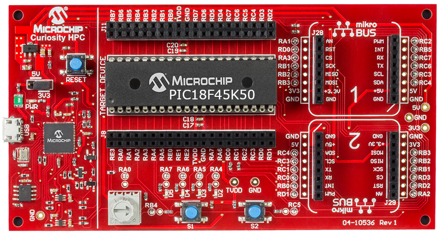
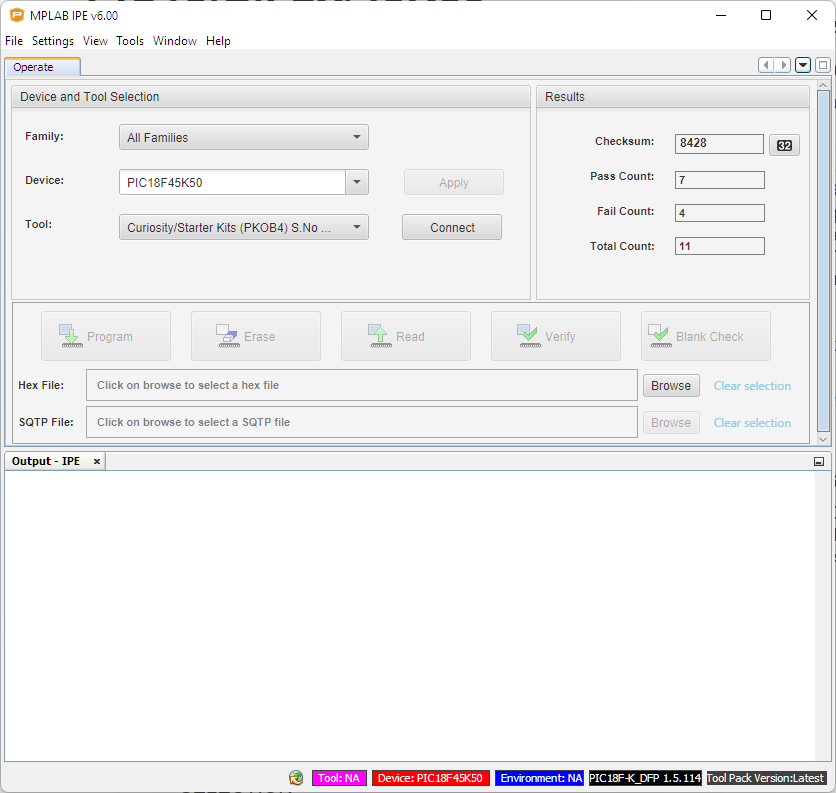
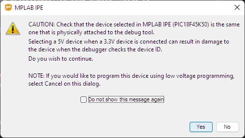
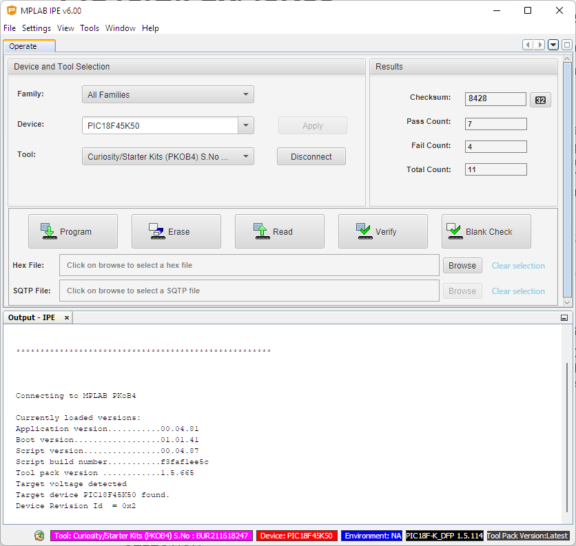
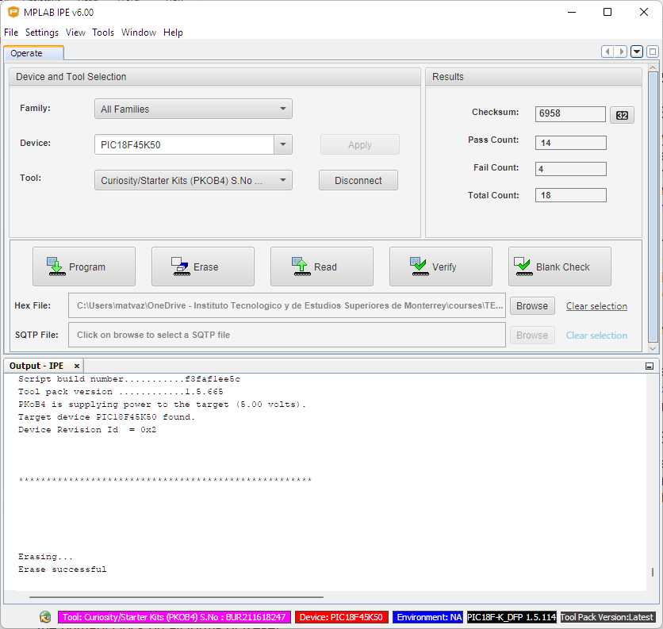
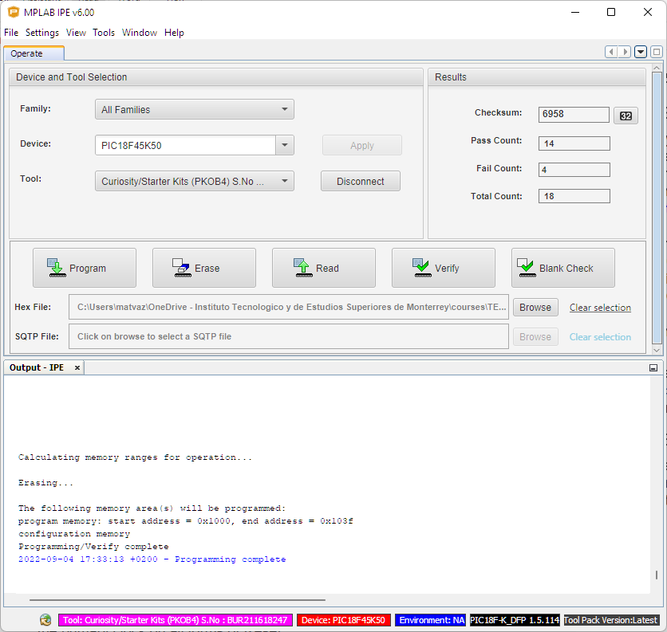
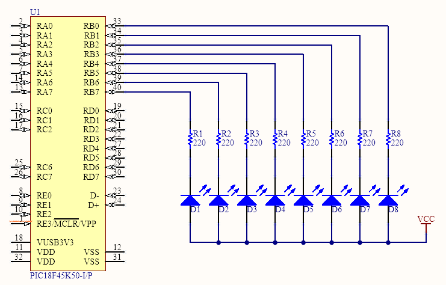
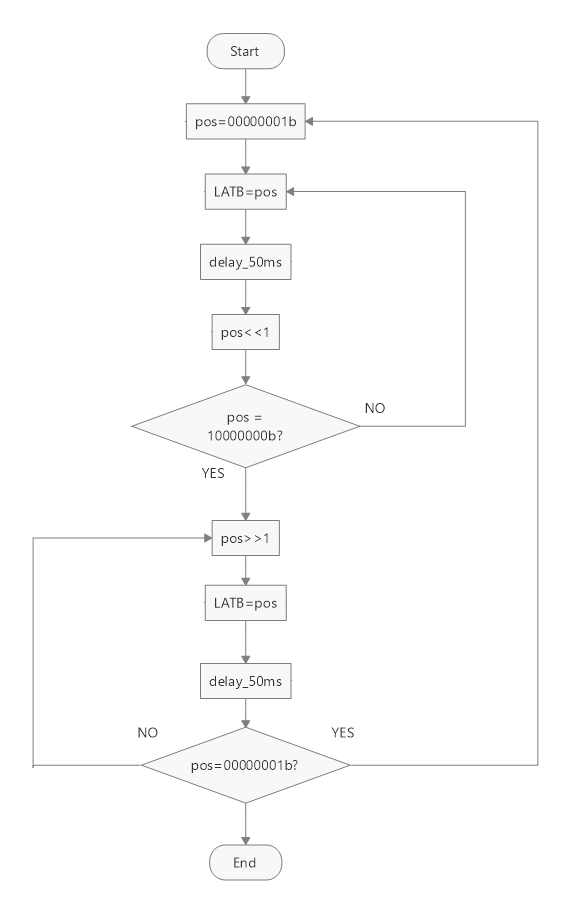

<p align="left">
  
</p>

# **LB4. GENERAL PURPOSE INPUT/OUTPUT**

## **OBJECTIVES**
* Program HEX files on microcontroller through MPLAB IPE and IDE
* Control a full GPIO port of the microcontroller
* Develop complex LED sequences using PIC-AS
* Understand flowchart to develop PIC-AS code
* Translate C code to PIC-AS code 

## **DESCRIPTION**
Before the laboratory session, it is important that you borrow a Cursiosity HPC board and a PIC18F45K50 microcontroller from our electronics stockroom on A7-437. Usually, the Curiosity board already comes with a microcontroller on-board; however, make sure that the microcontroller's part number is PIC18F45K50. If this is not the case, you can either ask for a different board or for the correct microcontroller and mount it yourself on the board. Below is an image of the Curiosity HPC board with the 40-pin PIC18F45K50 microcontroller.

<div align="center">
   
</div>

## **LIST OF MATERIALS**
The full list of materials for LB4 is shown below:

<div align="center">

| QTY | DESCRIPTION |
|:---:|:---|
| 1 | [Curiosity HPC board](http://ww1.microchip.com/downloads/en/devicedoc/40001856a.pdf) |
| 1 | [PIC18F45K50 microcontroller](https://ww1.microchip.com/downloads/aemDocuments/documents/OTH/ProductDocuments/DataSheets/PIC18F2X_45K50-30000684B.pdf) | 
| 8 | LEDs|
| 8 | Resistor 220Ω|
| 1 | Breadboard |
| 1 | MicroUSB cable |
| * | Prototype wires |
</div>

## **LABORATORY PROCEDURE**
In this laboratory you will test the correct functioning of your development board on Exercise 1. Then, you will develop 3 different LED sequences using delays and Port B of the microcontroller. The exercises are meant to be developed by you as a team, and each team member will describe each exercise on the demonstrative video.

### **EXERCISE 1: TEST YOUR DEVELOPMENT BOARD AND MICROCONTROLLER**
To make sure of the proper functioning of your board and microcontroller we will program the microcontroller through the board using Microchip's Integrated Programming Environment (IPE). 

1. Connect the Curiosity HPC board with the PIC18F45K50 µc to your personal computer through the MicroUSB cable. Make sure that the __Active__ LED turns on (green LED at bottom left corner of the board).

2. Download file [BlinkLED_PIC18F45K50.hex](BlinkLED_PIC18F45K50.hex) from our repository and save it in a known location.

3. Open Microchip's MPLAB IPE 
<div align="center">
   
</div>

4. Once MPLAB IPE has loaded, the main screen will show the __Operate__ tab. Under this tab, locate the _Device and Tool Selection_ section and under Device, type in the target microcontroller part number, which is _PIC18F45K50_.

<div align="center">
   
</div>

5. Then, Under Tool, choose _Curiosity/Starter Kit (PKOB4)_ and click _Connect_. click _Yes_ on the message will pop-up.

<div align="center">
   
</div>

6. After the software connects to the microcontroller, information about the board and target device will be shown on the __Output__ window. Verify that under __Device__ tag highlighted on red, you have __PIC18F45K50__.

<div align="center">
   
</div>

7. Under __Hex File__ click _Browse_ and locate the BlinkLED_PIC18F45K50.hex" file that you previously downloaded from our repository. This is the file we will program to the microcontroller.

8. Click first on the __Erase__ button to erase the previous firmware on the microcontroller. An _Erase successful_ message should appear on the __Output__ window.

<div align="center">
   
</div>

9. Then, click on __Program__ to download the hex file to the target device. 

<div align="center">
   
</div>

10. At this point your device must be programmed; however, it needs to be restarted to start executing the firmware. The easiest way to do so, is to unplug the MicroUSB cable and plug it in back again. Since the firmware is programmed on the Flash memory of the device, it is not erased when the power is interrupted. The on-board LED connected to RA4 should start blinking every 1 second.

### **EXERCISE 2: BLINK 8 LEDS USING PORT B**
1. Connect Port B of the 18F45K50 device to 8 LEDs through the current limiting resistors, as shown in the schematic. Remember that each LED cathode is connected to TVDD, which means that the LEDs will turn on when the µC pin output is a logic `low`. 

2. Use `TVDD` and `GND` pins from the board to power up your LEDs.

<div align="center">
   
</div>

3. Create an MPLAB X project for the PIC18F45K50 device and write a program that turns on all 8 LEDs at the same time. Use a delay of 200 ms for the ON and OFF states of the LEDs. For this, use `delays.inc` library, which contains a variety opf delays for you to use in your programs. Use the following code as a reference:

```
PROCESSOR   18F45K50
#include    <xc.inc>
#include    "configuration_bits.inc"
#include    "delays.inc"

PSECT udata_acs
; DECLARE HERE YOUR VARIABLES WITH FORMAT: "VAR_NAME: DS 1"

PSECT	resetVec, class=CODE, reloc=2

PSECT	absdata, abs, ovrld
absdata:
    org	    0x1000

resetVec:
    goto    MAIN

PSECT code
MAIN:
    ; CLOCK CONFIGURATION
    BANKSEL OSCCON	;ACCESS TO OSCCON REGISTER 
    MOVLW   0x5E	   ;4MHZ FREQUENCY OF INTERNAL OSCILLATOR
    MOVWF   OSCCON,1	;LOAD DATA THROUGH BSR

    ; GPIO CONFIGURATION
    CLRF    TRISB,0   ;CONFIGURE PORT B AS OUTPUT
    SETF    LATB,0    ;TURN OFF LEDS CONNECTED TO PORT B

; ---------------------;
; WRITE HERE YOUR CODE ;
;----------------------;

END resetVec
```

### **EXERCISE 3: THE KNIGHT RIDER SEQUENCE**
For the _Knight Rider_ sequence you will use 8 LEDs and the 8 bits of Port B from your &mu;C. This is a LED driving sequence that switches on a series of LEDs one after the other in one direction, and when the last LED is reached, it turns back on the opposite direction, as seen below. This sequence was used in the 90's TV show "The Knight Raider", hence the name. 

<div align="center">
   
</div>

Create a project named "KnightRider" and include the files __LB4_delays.inc__ and __configuration_bits.inc__ in your headers folder. A 50 ms delay is recommended between LEDs switching; that is, turn on the first LED and keep it on for 50 ms, then turn it off and turn on the following LED for another 50 ms, and so on. The flowchart below shows one of many ways to achieve the Knight Rider sequence; take your time to understand the chart before coding your solution. 

<div align="center">
   
</div>

As a reference, the code below is the C program for the Knigh Rider sequence that obeys the flowchart shown above. Use this code as a reference to write your equivalent PIC-AS code. 

```c
char pos = 0x01;        // HEX value for 00000001b
char i;                 // Index variable
for (i=0; i<7; i++){    // Drive the first 7 LEDs from right to left
   LATB = pos;          // Port B = 00000001 (turn on the first LED)
   __delay_ms(step);    // Wait for value in step (in ms)
   pos = pos<<1;        // Left shift value in 'pos' 1 bit (00000010)
}
for (i=7; i>0; i--){    // Drive from LED 8 to LED 1 from left to right
   LATB = pos;          // Port B = 10000000 (turn on the last LED)
   __delay_ms(step);    // Wait for value in step (in ms)
   pos = pos>>1;        // Right shift value in 'pos' 1 bit (01000000)
}
```

### **EXERCISE 4: THE MUSTANG EMERGENCY LIGHTING SEQUENCE**
The final sequence emulates the emergency lighting for a 2014 Ford Mustang. At this point you should be able to completely develop the code yourself. The expected LED sequence is shown below:

<div align="center">
   
</div>

## __DELIVERABLES__ [](https://experiencia21.tec.mx/courses/286463/assignments/9678300?module_item_id=18507992)

Deliverables for LB4 are:
1. A 4-minute video showing the 8 LED series running exercises 2 through 4. Each member of the team is in charge of explaining one exercise and must cover the code developed as a solution

2. Upload your LB4.X project to your GitHub repository. Your source code must be commented to explain what each line does.

3. Share the link to your video and MPLAB project on CANVAS. 
