<p align="left">
  
</p>

# **LB5. Fundamentals of C for PIC programming**

## **OBJECTIVES**
* Create projects on MPLAB X
* Set configuration bits using MPLAB Code Configurator
* Drive LED strings in your expansion board using a port of the microcontroller

## **DESCRIPTION**
In this lab, we will make the transition from low level programming using PIC-AS to high level programming using C. For this, we will go through LED sequences just as we did on LB4; however, this time we will code the sequences on C, which will be useful to understand the difference between low level and high level programming and learn the advantages and disadvantages of both approaches. 

This time, to set the microcontroller configuration bits, we will use MPLAB Code Configuration, which allows us configure the µC using a graphical interface. 

## **LIST OF MATERIALS**
This is the first laboratory where we use the Curiosity Nano PIC18R57Q43 board. You as a tean can borrow one board from our stockroom at A7-437; make sure the required USB cable is also provided to you. 
<div align="center">

| QTY | DESCRIPTION |
|:-:|---|
| 1 | [Curiosity Nano PIC18F57Q43 board](https://www.microchip.com/en-us/development-tool/DM164150) |
| 1 | Curiosity Nano __Expansion board__ |
| 1 | MicroUSB cable |
</div>

## **PRE-LAB WORK**
Before our lab session it is required that you install the development tools we will use; this include _MPLAB X_, which is Microchip's integrated development environment (IDE). As we will write C code for an 8-bit microcontroller (&mu;C) architecture, we also require to install the corresponding Microchip's C compiler, so called _XC8_. We will also make use of a plugin that will help us generate configuration code in a straightfoward way, which is called MPLAB Code Configurator (MCC). Finally, we will use GitHub for version control of our PIC18 coding projects. 

The following three sections will guide you with the installation and setup of all the required tools for our lab; so make sure you properly install everything before our lab session. 

### __1. MPLAB X IDE__
1. Go to https://www.microchip.com/mplab/mplab-x-ide, scroll down to Downloads section and download the latest version of MPLAB X IDE
2. Install it in your computer.

### __2. XC8 COMPILER__
Download it and install it from the official [Microchip Compilers website](https://www.microchip.com/en-us/development-tools-tools-and-software/mplab-xc-compilers).

### __3. MPLAB'S CODE CONFIGURATOR__

On MPLAB's upper toolbar you should see the MCC icon. If not, it is necessary to install the plugin. See image below for your reference: 
<p align="center">
  
</p>

To install MCC or any other MPLAB plugin, go to Tools → Plugins → Available Plugins, and on the search bar type MCC to search for the plugin. You should see `MPLAB Code Configurator` listed now. Check the box on the left and click the Install button below to pop up the installer window. 

<p align="center">
  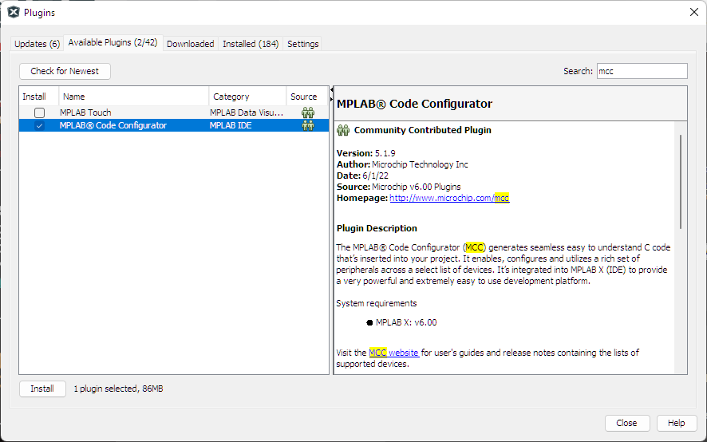
</p>

Once the installation is done, MPLAB will restart and you should see the Netbeans launching window, meaning MCC was correctly installed. 

<p align="center">
  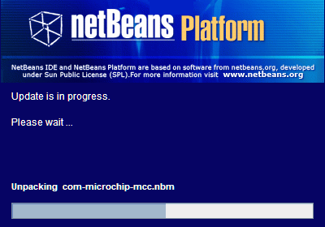
</p>

You should see the MCC icon on the MPLAB upper bar now. 

## **LABORATORY PROCEDURE**
### __EXERCISE 1: CREATE YOUR FIRST PROJECT IN C: BLINKY LED__

1. Connect the Curiosity Nano PIC18F57Q43 board to your PC.
2. Start MPLAB X IDE. Go to *File -> New Project* and under *Categories*, select the *Microchip Embedded*; then, under *Projects* choose *Standalone Project*. Click *Next* to continue.

<div align="center">
   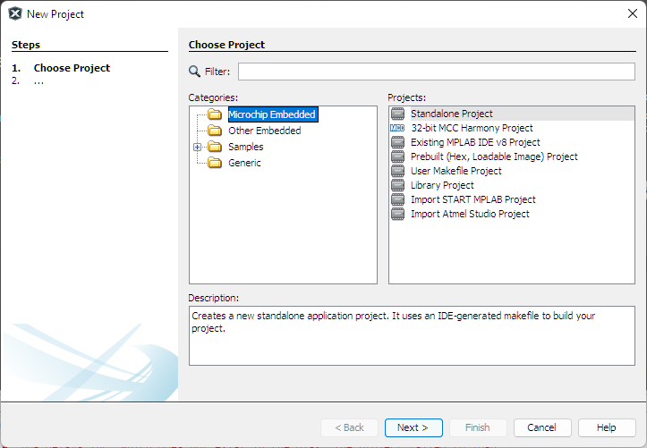
</div>

3. Select the __PIC18F57Q43__ device and for _Tool_, choose the *PIC18F57Q43 Curiosity Nano...* option (sometimes also displays just as *Curiosity*) and click *Next*.

<div align="center">
   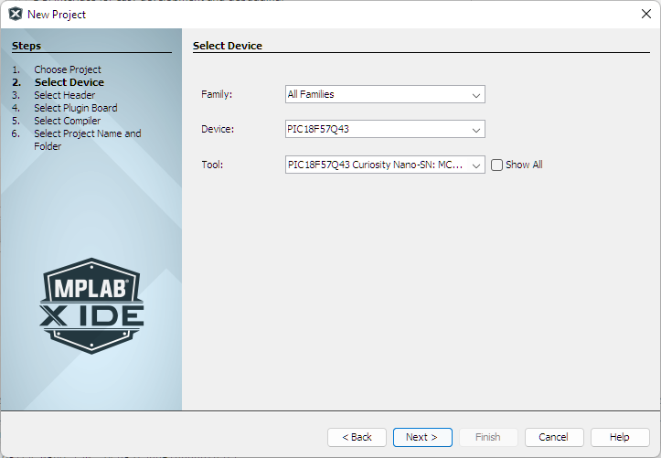
</div>

4. Choose the *XC8* Compiler Toolchain to build the program and click *Next*.

<div align="center">
   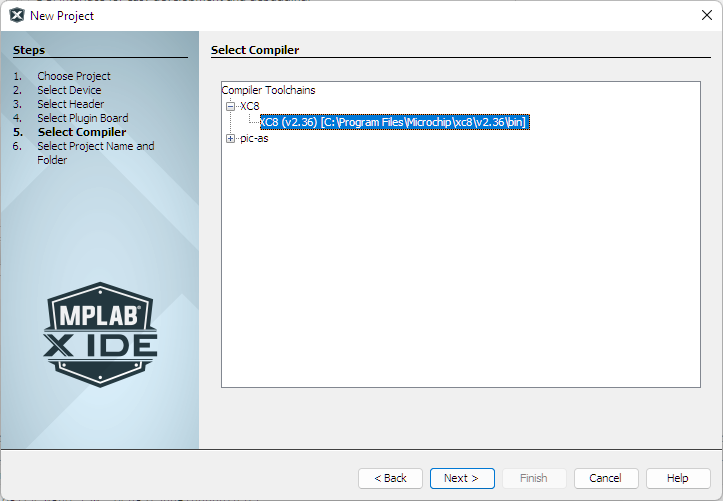
</div>

5. Choose the project location and name your project as __LB5__. Make sure that the project location path, directory and project name have no special characters and/or black spaces. Leave all the checkboxes as default. Then click *Finish*.

<div align="center">
   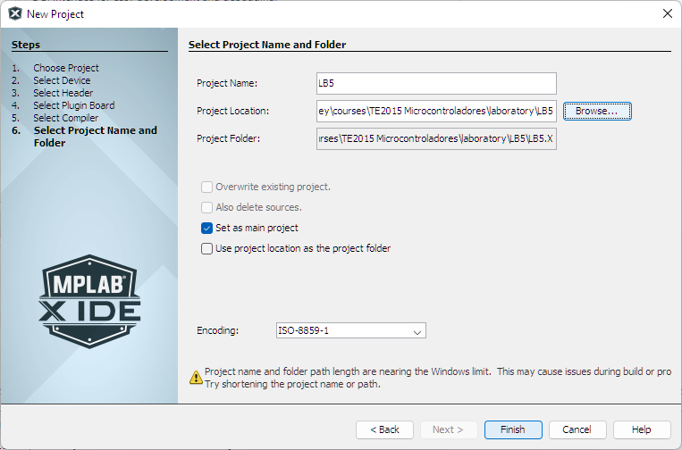
</div>

6. On the project dashboard (bottom-left corner), look up for the Project Properties button (wrench icon at the foremost left of the window) and click it to open the Project Properties window. 

7. Under *Tools → Embedded* select *MPLAB Code Configurator* to launch MCC (alternatively, you can just click the MCC icon con the toolbar).

8. After loading the components, the MCC Content Manager Wizard will show up. Click *Select MCC Classic* to continue.

<div align="center">
   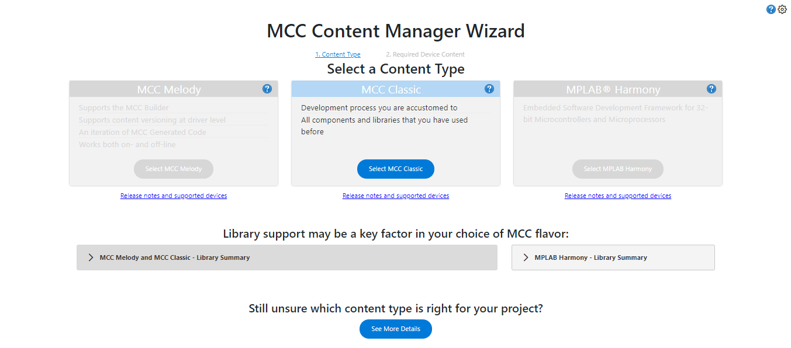
</div>

9. A second screen will tell you that there are some libraries that must be downloaded, as well as optional libraries that we might want to add to the bundle. 

<div align="center">
   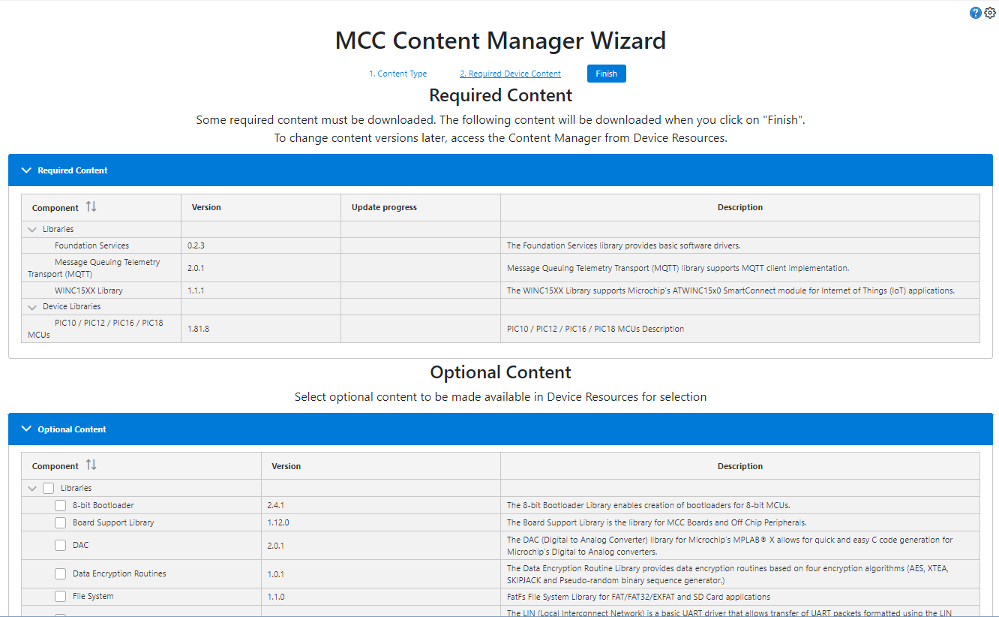
</div>

10. Leave everything as is and click *Finish*. After a few seconds of content downloading and installing, MCC will load and some tabs will show up on MPLAB. For a summary of MCC interface, see the figure below. 

<div align="center">
   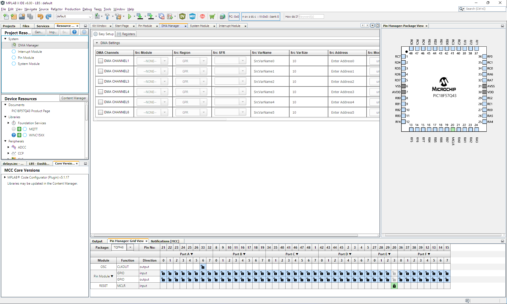
</div>

11. First off, we need to configure the clock signal that our &mu;C will use. Click on _System Module_ on the Project Resources window. The ``INTERNAL OSCILLATOR`` window will show up. Set the following parameters as follows:

<div align="center">

| PARAMETER | VALUE |
|---|:--:|
| Oscillator Select | ``HFINTOSC`` |
| HF Internal Clock | ``4_MHz``    |
| Clock Divider     | ``4``        |
</div>

With this, we will use the high-frequency internal oscillator operating at an initial frequency of 4 MHz, which is later divided by 4, resulting on a final clock signal of 1 MHz. Leave the rest of settings as default. 

12. On the Grid View of the Pin Manager (bottom window) you can see all the ports (A through F) and their corresponding pins of the &mu;C marked in light gray. 

13. Find __pin 0 of Port A__ on the grid and lock it as an *output*. It should turn green on the *output* row. This will configure RA0 as an output pin. 

<div align="center">
   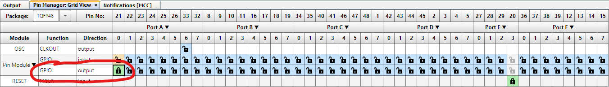
</div>

14. Under _Project Resources_ window, select _Pin Module_ to see the pins we have configured so far and only RA0 should be listed. Check that RA0 is checked under _Output_ column and disable all other checked options. 

15. Name RA0 as *MyLED* under *Custom Name* column for future references. 

<div align="center">
   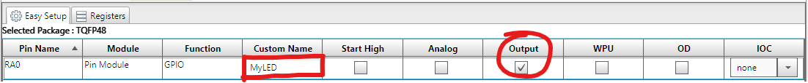
</div>

16. Click _Generate_ on _Project Resources_ window to generate the configuration code according to our MCC setup. With this, configuration files will be automatically added to your project files.

<div align="center">
   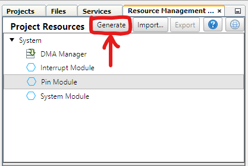
</div>

17. Make sure that the `Generation complete` message is displayed on the _Output_ window before proceeding. 

<div align="center">
   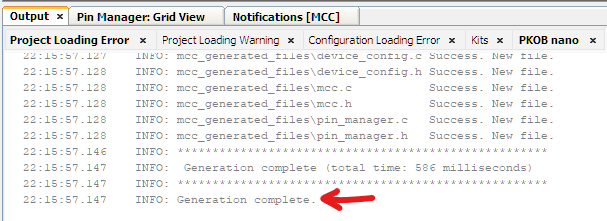
</div>

18. Click on the _Projects_ tab and expand Source Files to see the *MCC Generated Files* folder that contains three .c files: `device_config.c`, `mcc.c` and `pin_manager.c`. Double-click `device_config.c` to see its content. 

As its name suggests, the &mu;C configuration is carried out by `device_config.c`. This is done using the pre-processor directive `#pragma`. A first glance to the code shows different configuration parameters and their corresponding values, ordered in different blocks (`CONFIG1L`, `CONFIG1H`, etc.). We will not go over this at this point, but eventually we will learn to define the parameter values for our projects, according to our needs. 

19. Now, open `pin_manager.c`, where the ports of the &mu;C are configured and initialized by the function `PIN_MANAGER_Initialize()`. Here, you can see that three registers are used to initialize all ports: `LATx`, `TRISx`, and `ANSELx`.

20. Finally, `mcc.c` contains three initialization funtions, which are used for further initialization of the microcontroller. 
    1. `PMD_Initialize()`
    2. `PIN_MANAGER_Initialize()`
    3. `OSCILLATOR_Initialize()`

21. Take note of the registers involved in `mcc.c` and `pin_initialize.c` files and their assigned values, for further analysis.

22. Additionally, on the Header Files folder, you will find header files also added by MCC. Open `pin_manager.h` to take a look at its contents. Notice that this file is mostly comprised by `#define` macro constructs, which are also pre-processor directives. These definitions are available for us to use them instead of numerical values or register references. Accordingly, we will make use of `MyLED_Toggle()` macro to switch out LED on and off alternatively.

23. Under Source Files folder open `main.c`. This is our main source file and where most of our code will be located. 

24. Inside `void main(void)` function, find the `while(1)` loop statement and make a call to `MyLED_Toggle()` macro under the comment `Add your application code`. This will make RA0 to toggle its value each time the *while* loop is executed. 

```c
while (1)
{
    // Add your application code
    MyLED_Toggle();
}
```

25. Add a function call to the `__delay_ms()` XC8 built-in function to generate a delay. The argument inside the parenthesis is the time in miliseconds that the delay will last. Give this a value of `500` for 500 ms. Your code must look similar to the one below:

```c
while (1)
{
    // Add your application code
    MyLED_Toggle();
    __delay_ms(500);
}
```

26. This is all the coding we need to toggle a LED. Now you can build your project and program the &mu;C. To do this, go to _Production_ menu and select *Make and Program Device Main Project*. If no errors are found, your &mu;C should be programmed and you should see a ``Programming/Verify complete`` message in the Output window. If errors are found, you are encouraged to find the errors and correct them yourself before asking the lab instructor. If everything is working properly, you should see now the LED connected to RA0 blinking every second. See the blinking LED below:

<div align="center">
   
</div>

### __EXERCISE 2: THE KNIGHT RIDER SEQUENCE__
Now that you know how to create a project and generate the configuration files using MCC, you will practice with the _The Knight Rider_ sequence, which will make use of the 8 LEDs on your exppansion board, and the 8 bits of Port A of your &mu;C.

<div align="center">
   
</div>

1. Create a new source file and name it `knight_rider.c` and copy the contents of `main.c` into this new file.

2. Right-click on the `main.c` and select _Exclude file(s) from current configuragion_. This way you backup the code for Exercise 1 and you can modify `knight_rider.c` to solve Exercise 2.

3. Click the _Resource Management_ tab to modify the Port A configuration of your µC using MCC. This time, set all 8 bits of port A as outputs in the _Pin Manager: Grid View_.

<div align="center">
   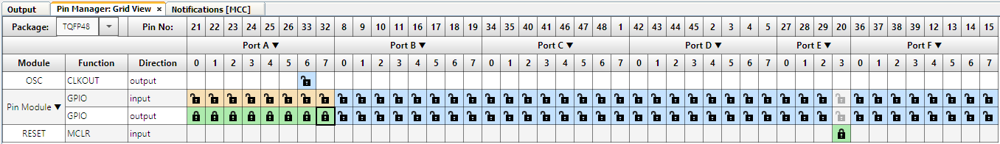
</div>

4. Select all 8 bits of Port A as outputs and uncheck the Analog box. Name Port A bits as KR0 to KR7. The setup should look similar to the image below:

<div align="center">
   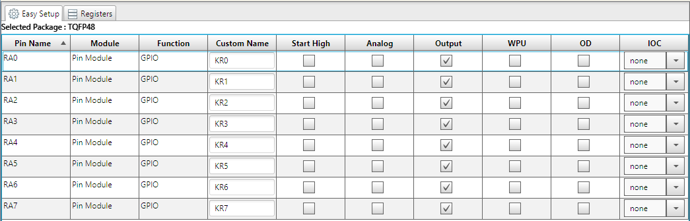
</div>

5. Generate the configuration code and open the Projects tab to see the project files. Under Source Files, open ``main.c``. After the ``#include`` directives, add a new definition to set a delay value of 50 ms to a parameters named ``step``:
```c
#define step 50
```
6. Then, locate the ``while(1)`` loop inside the ``main(void)`` function. After the ``//Add your application code`` line comment, add the following code:

```c
char pos = 0x01;        // HEX value for 00000001b
char i;                 // Index variable
for (i=0; i<7; i++){    // Drive the first 7 LEDs from right to left
   LATA = pos;          // Port A = 00000001 (turn on the first LED)
   __delay_ms(step);    // Wait for value in step (in ms)
   pos = pos<<1;        // Left shift value in 'pos' 1 bit (00000010)
}
for (i=7; i>0; i--){    // Drive from LED 8 to LED 1 from left to right
   LATA = pos;          // Port A = 10000000 (turn on the last LED)
   __delay_ms(step);    // Wait for value in step (in ms)
   pos = pos>>1;        // Right shift value in 'pos' 1 bit (01000000)
}
```
7. Build your project and program the µC. You should see the Knight Rider sequence running through the LEDs on your board.

### __EXERCISE 3: MUSTANG's EMERGENCY LIGHTS__
At this point, you are able to create a project in MPLAB X and make basic configurations using MCC. In this last exercise, you will practice what have you learned by coding a simple 8-LED sequence similar to the onw shown below. 

<div align="center">
   
</div>

1. Create a new source file and name it `mustang.c` and copy the content of `main.c` into this new file. 
2. Exclude `knight_rider.c` file from your project (right-click and select _Exclude file(s) from current configuration).
2. Write the C code to drive the 8 LEDs on you expansion board as seen in the previous animation. 

## __DELIVERABLES__ 
Deliverables for LB5 are described below. Once you complete your laboratory solution, make sure to upload the deliverables as indicated and share only the links to the deliverable. It is not accepted as a

1. __[60%]__ Demostrative video

   * Prepare a video (7 minutes maximum) showing your expansion board running exercises 1, 2 and 3 of this lab and explaining the following:
      
      __EXERCISE 1__
      * Explain the purpose of the values assigned to registers `OSCCON1`, `OSCCON3`, `OSCEN`, `OSCFRQ`, `OSCTUNE` and `ACTCON` in function `OSCILLATOR_Initialize()` in MCC-generated file `mcc.c`. 
      * Explain the purpose of the values assigned to registers `LATx`, `TRISx`, `ANSELx`, `WPUBx` in function `PIN_MANAGER_Initialize()` in MCC-generated file `pin_manager.c`.

      __EXERCISE 2__ 
      * Use the on-board debugger to show the change on the values of register LATA, as the Knight Rider sequence runs. Use breakpoints on the `LATA = pos;` lines of code in both `for` loops to skip the delay functions.
      
      __EXERCISE 3__

      
   * __Each member of the team MUST explain one exercise__
   * Your video must be uploaded to your favorite video platform (YouTube, TikTok, Instagram, etc.) and you will only have to submit the link to it in the corresponding Canvas activity.

2. __[40%]__ MPLAB X project 
   * Push your complete MPLAB project folder on a GitHub repository. 
   * Your source code __must be commented to explain what each line does__ so it can be easily understood by others.
   * __Do not compress the project folder.__ You must directly push the full project folder and files in their original format using Git.
   * Share the link to your LB5 repository on the comments section of your video post page. Consider that on Canvas it will only be allowed __one external link entry__, thus no other way of reporting your work is possible. __Make sure to set your video as Private, so only people with the link to it can watch it.__

The due date for LB5 is __Monday, September 26__. Submit your solution:

<div align="center">

[](https://experiencia21.tec.mx/courses/286463/assignments/9678301)
</div>