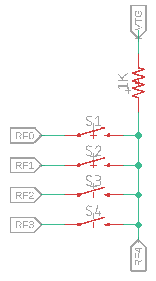
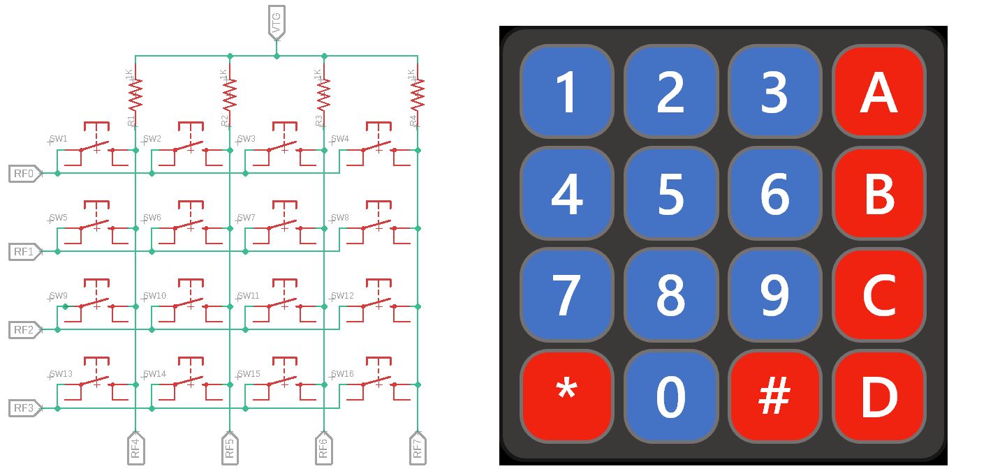

<p align="left">
  
</p>
<div align="right">

</div>

# **LB6. GPIO: 4x4 Keypad & 7-Segment Display**
As of this laboratory, we will develop code to drive different peripherals and communication protocols and we will start with the 4x4 keypad and the 4-digit 7-segment display that you have available in your expansion board. For this, it is important to know from the beginning that these devices require the use of delays, as many other devices that we will learn to drive the the following laboratories. It is also important to be remember which ports of the microcontroller are connected to each peripheral (you can easily recall this information from the schematic you used to design your board).

## **OBJECTIVES**
 
* Implement a sweeping routine to acquire 16 data values from a 4x4 keypad using 8 input/output pins.
* To know the function and interactions between the pull-up resistor and input/output ports of a device. 

### **LAB PROCEDURE**
Pull-up resistors are used to temporarily force the voltage of a node to a know value, such as V<sub>CC</sub>. This is due to the open-circuit voltage as seen from the node itself (see left side of the figure below). Once a switch short-circuits such node to GND, the node is consequently forced to a 0 V value. From the digital logic perspective, we can state that when the switch is open, the node (thus the &mu;C input pin in the figure below) has a logic 1, and when the switch is closed (button pressed), the node and the input pin have a logic 0.
<div align="center">


</div>

The working principle of a matrix keypad is that it connects several switches to a single input of a microcontroller, and the driver we will write is in charge of identifying which key is pressed by __multiplexing__ the signals that power up the buttons. A basic schematic diagram for a 1-column, 4-rows keypad is shown below:
<div align="center">

</div>
To identify which button in the column is pressed, we have to be able to control the current flow from output pins RF0 through RF3, and the input pin RF4. Here, we can apply either a logic 0 (GND) or a logic 1 (VCC) to each output pin (RF0 through RF3) independently and read the logic value at RF4. If we break down all possible cases in this circuit we have:

* __CASE 1. No buttons are pressed.__ Here, RF4 reads a logic 1 from VTG
* __CASE 2. S1 is pressed.__ The value at RF0 is read at FR4
* __CASE 3. S2 is pressed.__ The value at RF1 is read at FR4
* __CASE 4. S3 is pressed.__ The value at RF2 is read at FR4
* __CASE 5. S4 is pressed.__ The value at RF3 is read at FR4

If we assign a logic 0 to only one of the output pins and a logic 1 to the rest, __we can identify if the button connected to the pin with a 0 is pressed because we would read a 0 at RF4__. For example, we can assign RF0 with 0 and the rest of the pins with 1. In this case, we would write to the lower nibble of Port F with `1110` (i.e., `0xE`) to write to `RF3=1`, `RF2=1`, `RF1=1` and `RF0=0`, respectively. We then read the value at RF4. If we read a 0, it means S1 is pressed, and if we read a 1, it means either none of the buttons are pressed or any of S2, S3 or S4 is pressed; however, to this point, we can't identify any of those yet. We then move the 0 to the second row by assigning `1101` (`0xD`) to the lower nibble of Port F and read the value at RF4. If we read a 0, it means S2 is pressed. We continue shifting the 0 until we get to the last row (lowe nibble of port F with `0x7`) and each time we assign a new value to the lower nibble of Port F, we read the value at RF4 to identify if the corresponding button with the output at 0 is pressed. 

The same procedure applies when more than one column are used. If we have four rows and four columns, 8 pins from the &mu;C are required: 4 for multiplexing the active row, and 4 to read the value at each column. In this case, we would need to read the upper nibble each time to figure which button of the four columns is pressed:
<div align="center">

</div>

Assuming the top row is Row 1, and leftmost column is Column 1, we control the values assigned to Rows 1 through 4 by RF0 through RF3, respectively. We also read a 4-bit value at RF4 through RF8. If we assign `RF=0xE` to activate Row 1, then we can check for any button on the top row to be pressed. If the upper nibble of RF reads `0x0111`, it means that `SW1` is pressed (Row 1 shorted to Column 1 by `SW1`). If we, instead, read `0x1011`, it means that `SW2` is pressed (Row 1 shorted to Column 2 by `SW2`), and so on. We then shift to Row 2 and repeat the reading process. 

The correspondance for each key of the 4x4 keypad shown above to the input/ouput nibbles of port F can be seen in the table below:

<div align ="center">

Key | Output | Input
:---:  | :---: | :---:
1  | Row 1 `[ 0111 ]` | Column 1 `[ 0111 ]`
2  | Row 1 `[ 0111 ]` | Column 2 `[ 1011 ]`
3  | Row 1 `[ 0111 ]` | Column 3 `[ 1101 ]`
A  | Row 1 `[ 0111 ]` | Column 4 `[ 1110 ]`
4  | Row 2 `[ 1011 ]` | Column 1 `[ 0111 ]`
5  | Row 2 `[ 1011 ]` | Column 2 `[ 1011 ]`
6  | Row 2 `[ 1011 ]` | Column 3 `[ 1101 ]`
B  | Row 2 `[ 1011 ]` | Column 4 `[ 1110 ]`
7  | Row 3 `[ 1101 ]` | Column 1 `[ 0111 ]`
8  | Row 3 `[ 1101 ]` | Column 2 `[ 1011 ]`
9  | Row 3 `[ 1101 ]` | Column 3 `[ 1101 ]`
C  | Row 3 `[ 1101 ]` | Column 4 `[ 1110 ]`
\* | Row 4 `[ 1110 ]` | Column 1 `[ 0111 ]`
0  | Row 4 `[ 1110 ]` | Column 2 `[ 1011 ]`
\# | Row 4 `[ 1110 ]` | Column 3 `[ 1101 ]`
D  | Row 4 `[ 1110 ]` | Column 4 `[ 1110 ]`

</div>

1. Create a new C project named __LB6.X__ for the PIC18F57Q43 device.

2. Use MPLAB X's Code Configurator to set the following: 
   * HFINTOSC at 4 MHz with a divider of 4.
   * Pins RF0, RF1, RF2 and RF3 as outputs. Name these pins KRO1 through KRO4, respectively.
   * Pins RF4, RF5, RF6 and RF7 as inputs. Name these pins KCI1 through KCI4, respectively.
   * Port B as an output. Name pins 0 through 6 as SEG_A, SEG_B,..., SEG_G, respectively, and Pin 7 as SEG_P. 
   * Port C, pins 0 through 3 as outputs. Name these pins as DIG_1 through DIG_4, respectively.

3. Then, function `char_to_seg()` is a 8-bit value to 7-segment encoder. This means it converts the four least-significant bits of an 8-bit binary value stored in a `uint8_t` variable, into an 8-bit value corresponding to the 7-segment codification, stored in a `uint8_t` variable. [Use the BCD to 7-segment encoding table](7-seg_encoding.md) as a reference. Add this function to your `main.c` file.

```C
uint8_t char_to_seg(uint8_t num){
    uint8_t segments;
    switch(num){
        case 0:  segments = 0b00111111; break;
        case 1:  segments = 0b00000110; break;
        case 2:  segments = 0b01011011; break;
        case 3:  segments = 0b01001111; break;
        case 4:  segments = 0b01100110; break;
        case 5:  segments = 0b01101101; break;
        case 6:  segments = 0b01111101; break;
        case 7:  segments = 0b00000111; break;
        case 8:  segments = 0b01111111; break;
        case 9:  segments = 0b01100111; break;
        case 10: segments = 0b01110111; break;
        case 11: segments = 0b01111100; break;
        case 12: segments = 0b01011000; break;
        case 13: segments = 0b01011110; break;
        case 14: segments = 0b01111001; break;
        default: segments = 0b01110001; break;
    }
    return segments;
}
```

4. Function `send_to_disp()` breaks down a 32-bit word (`uint32_t`) containing four 8-bit binary numbers (`0x01 + 0x02 + 0x03 + 0x04`), encodes each 8-bit digit by calling `char_to_seg()`, and sends each encoded byte to the 7-segment display. The 32-bit variable is composed by four 8-bit variables, each containing the digit to be desplayed at the 4-digit display (i.e., a value of `0xA8E2` shows `A8E2` on the display). Add this function as well to your `main.c` file.

```C
void send_to_disp(uint32_t disp_word){
    for (char i = 0; i < 4; i++){
        int internal_sweep = (int) pow(2, i);
        int sweep = 0x0F & ~internal_sweep;
        LATC = (char) sweep;
        uint8_t num_disp = 0x000000FF & (disp_word >> i*8);
        LATB = char_to_seg(num_disp);
        __delay_ms(SWEEP_FREQ);
    }
}
```

5. Finally, the main function, `main(void)` calls for `key_scanner()` and displays the read value through `send_to_disp()`.

```C
void main(void) {
    // Initialize the device
    SYSTEM_Initialize();
   
    while (1){
        uint32_t num = 0x01020304;
        send_to_disp(key);
    }
}
```

6. We also need to include `stdint.h` and `math.h`. A `#define` directive is used to assign a value of 10 to `SWEEP_FREQ`, used by `key_scanner()`, and all user-defined functions in the code must also be declared:
```C
#include "mcc_generated_files/mcc.h"
#include <stdint.h>
#include <math.h>

#define SWEEP_FREQ 10

uint8_t char_to_seg(uint8_t);
void    send_to_disp(uint32_t);
uint8_t key_scanner(void);
```

7. With this base code, program your device and observe what is displayed. As you will see, each digit is turned on in a sequence (right to left) each time step paced by `SWEEP_FREQ`, while the rest remains off. This way, instead of using 8 pins (7 segments and decimal dot) + 1 pin (enable) to drive one 1-digit display in parallel (which would add up to 36 pins for four digits), we miltiplex the outputs to enable only one digit each time and assign the corresponding value to that digit using the same 8 segment bits for all four digits. This is common practice to drive 7-segment displays using &mu;Cs, FPGAs and other devices. To be able to see all digits _"on"_ at the same time, the sweeping frequency should be high enough, such as the human eye cannot detect when the segments turn off. 
      
8. Reduce the value of the macro `SWEEP_STEP` to a step value where you consider the four digits are displayed at the same time. Report this value.
      
9. Change the value of the `num` variable to display the numbers A, B, C and D instead of those displaying from the original project. Consider this should be in BCD format for numbers between 0x0 and 0xF. Show the displayed numbers in your report.

10. Write the function `uint8_t key_scanner()` to scan for a pressed key on the keypad. Your function must fulfill the following requirements:

   * Sweep each keypad row from top to bottom (bits `0` through `3` of **Port F**, configured as **outputs**)
   * Scan the columns from left to right (bits `4` to `7` of **Port F** configured as **inputs**) to detect for a pressed key
   * The function returns a `uint8_t` value corresponding to the pressed key (from `0x00` to `0x0F`)
   * No input arguments are required

_Note: since the keypad has hard-wired _*pull-up*_ resistors tying column inputs to V<sub>CC</sub> when a key is not pressed, and short-circuiting these pins to GND when a key is pressed it works with inverted digital logic._

11. Write the corresponding code in `main()` function to show the numeric value of the pressed key on the keypad, on the 4-digit 7-segment display of your expansion board. Consider the following restrictions: 
      
    * The _*#*_ symbol must show the `0xE` value (`0b1110`), and the __*__ symbol must show the `0xF` value (`0b1111`).

    * When a key is pressed, the number/letter value should be showed in the least significant digit of the 7-segment display (rightmost digit).
    
    * When another key is pressed afterwards, the previous digit should be left-shifted, and the new value should take place on the least significant digit.

12. Test your driver on the Curiosity board and record a demonstrative video presenting the display as it shows the corresponding digits as the keys on the keypad are pressed. 

## Deliverables
Record a 5-minute video showing your solution of the keypad driver on your expansion board. Include the following:
   1. Explain how the function `send_to_disp()` works
   2. Explain how the function `char_to_seg()` works
   3. Explain how your function `key_scanner()` works
